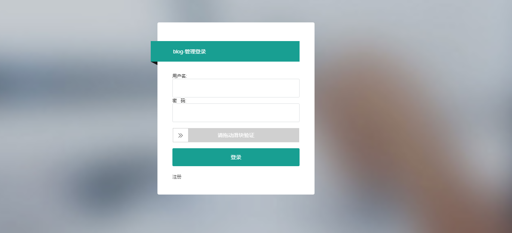
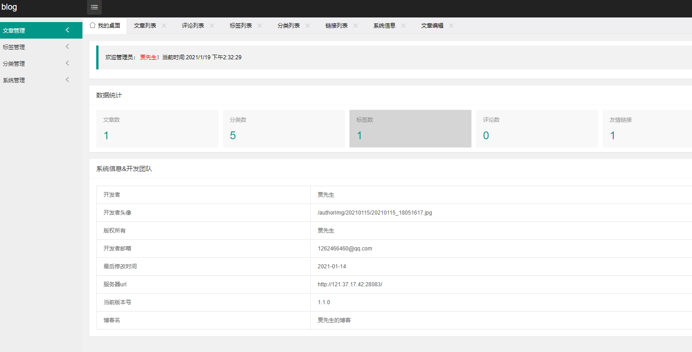

# My-Blog-layui

**坚持不易，各位朋友如果觉得项目还不错的话可以给项目一个 star 吧，也是对我们一直更新代码的一种鼓励啦，谢谢各位的支持。**

- **该项目基于原 [My-Blog-layui](https://github.com/ZHENFENG13/My-Blog-layui) 项目二次开发的 Spring Boot 实践项目，后台和博客的分页and评论采用全新的 layui 进行重构；**
- **你可以把它作为 SpringBoot 技术栈的学习项目**
- **技术栈新颖且知识点丰富，学习后可以提升大家对于知识的理解和掌握；**
- **，在原本的基础上添加了spring security，session管理；同时添加了部署方式，可以更加便捷的在服务器上面构建服务**


## 使用说明

- **数据库文件目录为```static-files/blog_db.sql```，替换了原来的用户表**

- **部署后你可以根据自己需求修改版权文案、logo 图片、备案记录等网站基础信息；**

- **My Blog layui 后台管理系统的目前默认账户是admin，admin**

- **有任何问题都可以反馈给我们，我们会尽量完善该项目。**


## 联系作者

> 大家有任何问题或者建议都可以在 [issues](https://github.com/jwh199588/My-Blog-layui-master/issues)中反馈，我们会慢慢完善这个项目。

- 贾先生的邮箱：1262466460@qq.com


## 效果预览

### 后台管理页面

- 登录页

	

- 后台首页

	

### 博客展示页面

- 首页

  
## 感谢

- [ZHENFENG13](https://github.com/ZHENFENG13/My-Blog-layui)
